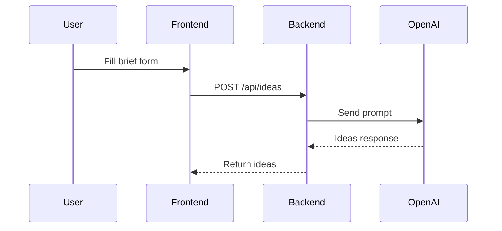
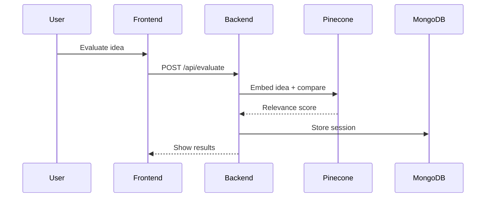

# 📡 API\_DOCS.md

## 🔐 Auth APIs

### POST /api/auth/signup

- **Request**: `{ name, email, password }`
- **Response**: `{ token, user }`

### POST /api/auth/login

- **Request**: `{ email, password }`
- **Response**: `{ token, user }`

## 👤 User Management

### GET /api/users/\:id

- **Auth**: Admin only
- **Response**: `{ user }`

## 🧠 AI Ideation

### POST /api/ideas

- **Request**: `{ audience, goals, theme }`
- **Response**: `{ ideas: [ { title, description } ] }`

## 📝 Briefs

### POST /api/brief

- **Request**: `{ clientInfo, goals, audience }`
- **Response**: `{ briefId }`

### GET /api/brief/\:id

- **Response**: `{ brief }`

## 💡 Evaluations (Phase 2)

### POST /api/evaluate

- **Request**: `{ ideaId, tags, goals }`
- **Response**: `{ score, justificationText }`

---

**All endpoints will return standardized error messages with 4xx/5xx status codes and details.**

