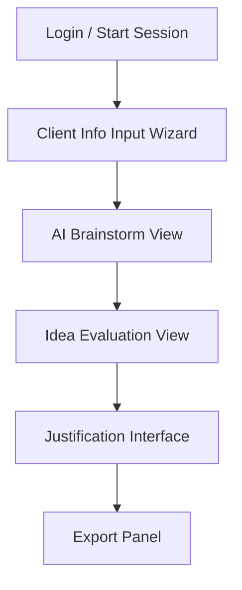
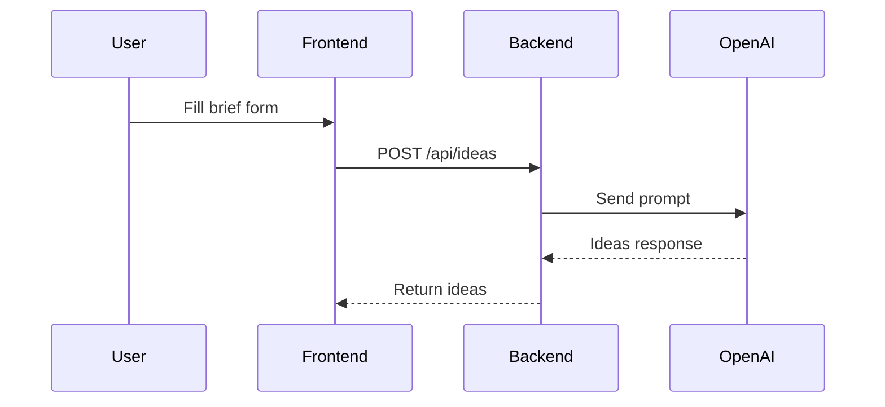
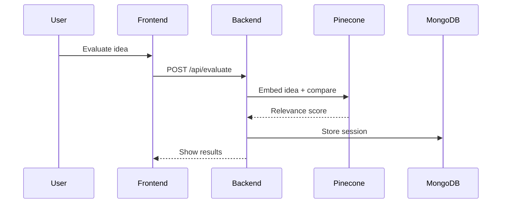
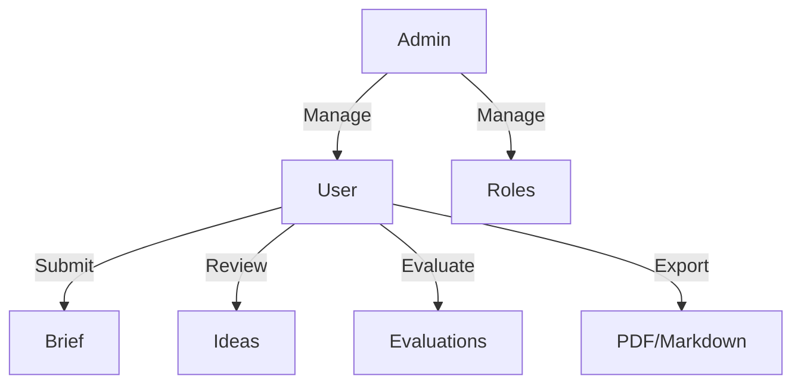

# 📊 DIAGRAMS.md

## 🧱 System Architecture (Component Diagram)
```mermaid
graph TD
  A[Client Browser] -->|HTTPS| B[React App]
  B --> C[Express Backend API]
  C --> D[MongoDB]
  C --> E[Pinecone Vector DB]
  C --> F[AI Integration (OpenAI or similar)]
```

## 👣 User Journey Flow (Guided Ideation)
```mermaid
flowchart TD
  A[Login] --> B[Input Client Brief]
  B --> C[AI Idea Generation]
  C --> D[Idea Evaluation (Manual & AI)]
  D --> E[Justify & Annotate]
  E --> F[Save or Export Output]
```

## 🔀 UI Flow (Frontend Screens)


## 🗂️ Database ER Diagram
```mermaid
erDiagram
  User ||--o{ Role : has
  User ||--o{ Brief : submits
  User ||--o{ Session : creates
  Session ||--|{ Idea : includes

  User {
    string _id
    string name
    string email
    string passwordHash
    string roleId
  }

  Role {
    string _id
    string name // User, Staff, Admin
  }

  Brief {
    string _id
    string userId
    string clientName
    string audience
    string goals
    string notes
    date createdAt
  }

  Session {
    string _id
    string userId
    string briefId
    date createdAt
    array ideaIds
  }

  Idea {
    string _id
    string sessionId
    string title
    string description
    array tags
    float score
    string justification
  }
```

## 🔁 API Workflows
### Ideation Flow


### Evaluation Flow


## 🧩 Use Case Diagram


