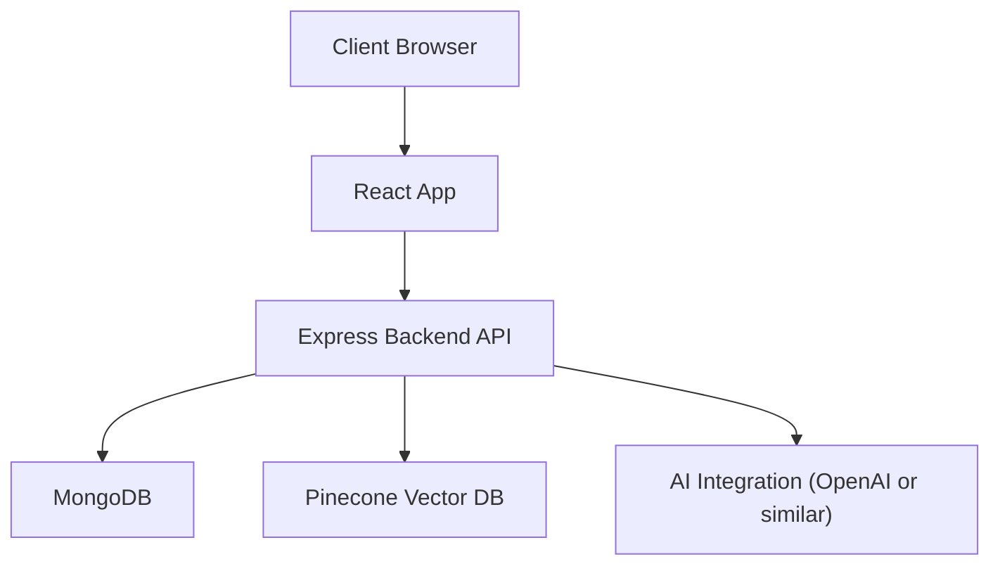
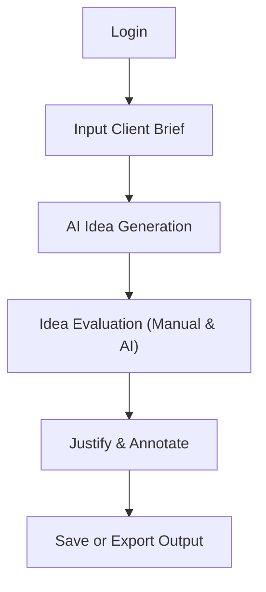
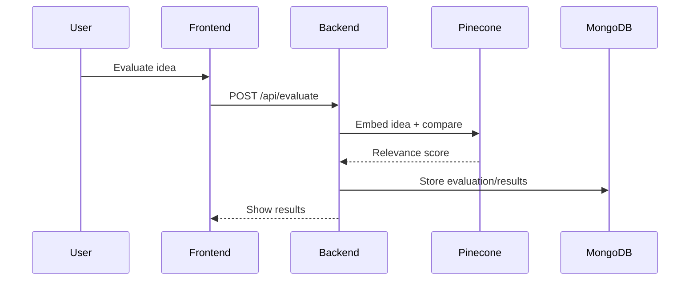
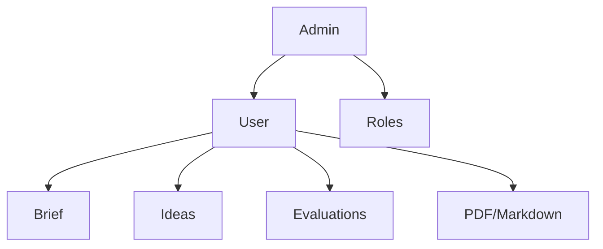

# 📊 DIAGRAMS.md

## 🧱 System Architecture (Component Diagram)


## 👣 User Journey Flow (Guided Ideation)


## 🔀 UI Flow (Frontend Screens)


## 🗂️ Database ER Diagram
```mermaid
erDiagram
  User }o--|| Role : assigned_to
  User ||--o{ Brief : submits
  User ||--o{ Session : creates
  Session ||--o{ Idea : includes

  User {
    string _id
    string name
    string email
    string passwordHash
    string roleId
  }

  Role {
    string _id
    string name
  }

  Brief {
    string _id
    string userId
    string clientName
    string audience
    string goals
    string notes
    date createdAt
  }

  Session {
    string _id
    string userId
    string briefId
    date createdAt
    array ideaIds
  }

  Idea {
    string _id
    string sessionId
    string title
    string description
    array tags
    float score
    string justification
  }```

## 🔁 API Workflows
### Ideation Flow
```mermaid
sequenceDiagram
  participant User
  participant Frontend
  participant Backend
  participant OpenAI

  User->>Frontend: Fill brief form
  Frontend->>Backend: POST /api/ideas
  Backend->>OpenAI: Send prompt
  OpenAI-->>Backend: Ideas response
  Backend-->>Frontend: Return ideas
```

### Evaluation Flow


## 🧩 Use Case Diagram


