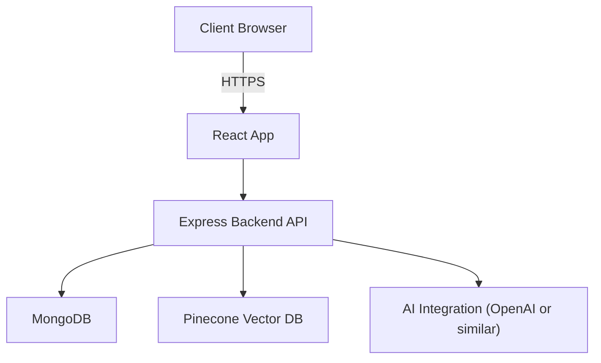
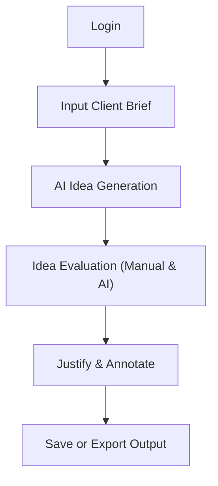
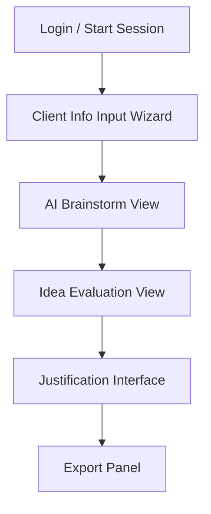
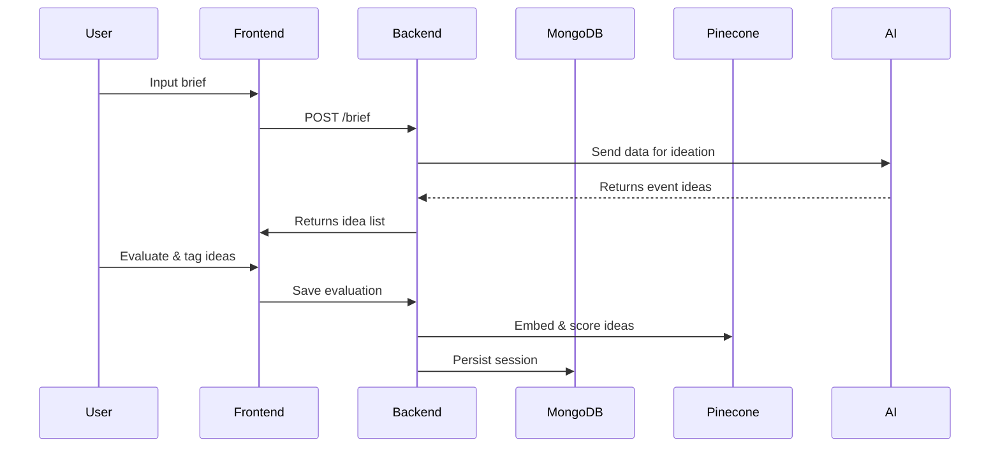

# 📘 PRD.md — Product Requirements Document

## 🧠 Executive Summary

**Event Slammer** is a creative ideation web application designed for agency and production company teams to rapidly transform abstract client briefs into compelling event ideas with the help of AI. By combining fast brainstorming capabilities with structured creative justification, it empowers teams to deliver aligned, high-impact concepts quickly.

## 🚀 Elevator Pitch

"Event Slammer helps agency teams go from vague client briefs to pitch-ready event ideas — fast. With AI-assisted brainstorming and creative evaluation tools, your team can generate, explore, and refine concepts that truly resonate with your client's business goals."

## ⚙️ Tech Stack

**Frontend**: Vite + React + Tailwind CSS 4.0 + TypeScript\
**Backend**: Node.js + Express.js\
**Database**: MongoDB\
**Authentication**: JWT with Role-Based Access Control (RBAC)\
**Vector DB for evaluation** (Phase 2): Pinecone

### 🌐 System Architecture

## 🧑‍💼 User Personas

- **Creative Director**: Oversees quality, curates final ideas.
- **Writer**: Crafts messaging around each event concept.
- **Project Manager**: Keeps ideation on track.
- **Account Manager**: Links ideas back to client goals and context.

### 👣 User Journey: Guided Ideation Flow

## 🧩 Core Features

### ✅ Phase 1: Event Slammer MVP

- Basic brief form (audience, goals, theme)
- Generate varied event ideas using AI
- Edit, copy, or delete ideas
- Responsive UI
- No save/logins

### ✅ Phase 2: Guided Creative Ideation MVP

- Login with roles (User, Staff, Admin)
- Step-by-step client brief input
- AI-enhanced ideation per step
- Evaluation: match ideas to goals
- Save session progress
- Justify ideas with AI help
- Vector DB scoring (Pinecone)
- Export results (PDF, Markdown)

## 🧑‍💻 User Experience Overview

### 🖼️ Design Language

- Modern, bento-style layout
- Warm, creative pastel color palette
- Large type, whitespace emphasis
- Inspired by Miro, Notion, Canva

### 🧭 UI Flow

## 📋 Non-Technical Requirements

- Accessibility (WCAG 2.1 compliant)
- Mobile-responsive design
- Data privacy: HTTPS, secure login, encrypted passwords
- Basic rate limiting for backend
- (Future) Dark mode and GDPR support

## 🧱 System Components

### Component Interaction

## 📚 Appendix

- All diagrams are duplicated in `DIAGRAMS.md` for reference.
- Data schemas, API details, and tasks are defined in respective files.

---

**This PRD is a living document. Features, architecture, and flows can evolve as the project progresses.**

